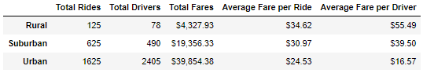

# PyBer_Analysis

## Overview:
After completing an analysis of ride-sharing data and creating visualizations for it, my manager, Omar, and I were given a new assignment by the company's CEO, V. Isualize, that would require our Python skills and knowledge of Pandas to complete a summary DataFrame of the ride-sharing data by city type, create a multiple-line graph to show weekly fares for each city type, and finally provide a written report tht summarizes how the data differs by city type and how the differences can be used for making decisions at PyBer.

## Results:

### The Summary DataFrame
By first opening the city_data.csv and ride_data.csv files into DataFrames, then merging them into one DataFrame, we were able to create a Pyber summary DataFrame to display the collected data separated city types and indexed by Total Rides, Total Drivers, Total Fares, Average Fare per Ride, and Average Fare per Driver. 

### Total Rides:
By far the largest city type for total rides is the urban cities at 1625 total rides. This was 2.6 times more than Suburban and 13 times more than rural.

### Total Drivers:
The largest city type for total drivers was urban at 2,405. Followed by Suburban at 490 and then rural at 78

### Total Fares
The largest total fares was again urban at $39,854.38. Suburban was next at $19,356.33. Rural was at $4,327.93

### Average Fare per Ride
By dividing the total fares by the total rides count, we can see that the rural city type had the largest average fare per ride at $34.62, followed by suburban at $30.97, then urban at $24.53.

### Average Fare per Driver
By dividing the total fares by the total drivers, we see that the rural city type had the most lucrative average per driver at $55.49, suburban came in at $39.50, and urban was at $16.57

## Summary:

In conclusion, we would add these three recommendations based off of the data shown:

1. With the higher demand in the urban cities and the lowest fare per ride average, are the rates set high enough? A higher rate may do little to impact the demand, but will increase the per ride average and per driver average.
2. With rural bringing in the highest average fare per ride and per driver, are the rates too high to allow for more demand? Lowering the rate my increase interest in using the ride-share service.
3. Only in urban cities are the total number of drivers larger than the total number of rides. Reducing the number of drivers will increase fare per ride and fare per driver numbers. But be careful that you don't lose customer satisfaction.

One additional recommendation: Consider analyizing addintional data like distances driven by city type, which may impact directly the profitability of the per ride and per driver fares.
